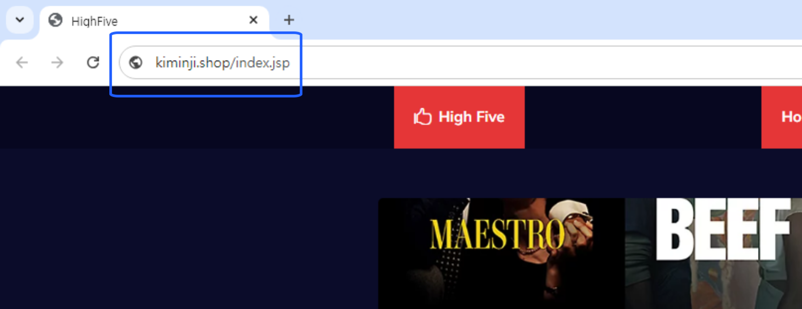

# 💻 Team Project
 

📜 목차
---
1. [프로젝트 목적](🎨-프로젝트-목적)
2. [프로젝트 일정](📅-프로젝트-일정)
3. [프로젝트 개요](📍-프로젝트-개요)
4. [기술 스택](📍-기술-스택)
5. [산출물](📍-산출물)

 

🎨 프로젝트 목적
---
AWS EKS를 활용한 3-Tier 구축
- Private Cloud(AWS)를 구축하여 안전하고 효율적인 인프라 운영을 목표로 한 프로젝트입니다.

 

📅 프로젝트 일정
---
- 일정: 2024년 8월 16일 ~ 9월 6일 (3주)

 

📍 프로젝트 개요
---
다양한 OTT 플랫폼 서비스가 생겨나면서 고객들에게 다양한 OTT 콘텐츠 정보를 한 눈에 볼 수 있고 시청까지 이어지는 프로젝트를 기획했습니다. 
 

이 프로젝트의 목적은 다양한 OTT 정보를 한 플랫폼을 통해 이용할 수 있도록 **플랫폼을 구축**하고 **예상치 못한 과부화로 인해 서비스가 중단되는 것을 방지**하는 것이었습니다.

 

📍 기술 스택
---

 

📍 산출물
---
#### 🌎 아키텍처

 

#### 🌎 주요 기능
- **AWS ALB 사용: Ingress를 통해 외부에서 접속 가능**

 

- EFS: EC2 인스턴스 간 파일 공유 및 파일 용량 자동 확장

 

- Redis 구성
       

 

#### 🌎 Rolling Update & Roll Back

https://github.com/user-attachments/assets/71a0c795-f06c-4499-ba36-1a9c2ae4371a

 

#### 🌎 부하테스트

https://github.com/user-attachments/assets/9497b96b-2efa-4b66-9359-acd548e86f75

